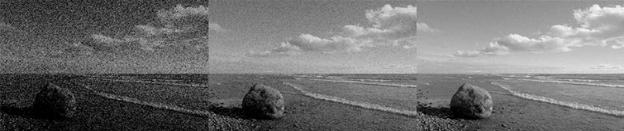

**What are types of noise?**

**What is noise:**

-Image noise is random variation of brightness or color information in the images captured. It is degradation in image signal caused by external sources

**Sources of noise:**

During picture acquisition and transmission, noise may be introduced into the image. The quantification of noise is determined by the number of corrupted pixels in the image.

The following are the primary sources of noise in digital images: –

- Environmental factors may have an impact on the imaging sensor. 
- Low light and sensor temperature may cause image noise. 
- Dust particles in the scanner can cause noise in the digital image. 
- Transmission channel interference.

**Types of Image noise:**

There are different types of image noise. They can typically be divided into 3 types.

1. **Gaussian Noise:**

Gaussian Noise is a statistical noise having a probability density function equal to normal distribution, also known as Gaussian Distribution. Random Gaussian function is added to Image function to generate this noise. It is also called as electronic noise because it arises in amplifiers or detectors. 

Source: thermal vibration of atoms and discrete nature of radiation of warm objects.
1. ## **Impulse Noise:**
There are three types of impulse noises. Salt Noise, Pepper Noise, Salt and Pepper Noise.

**Salt Noise:** Salt noise is added to an image by addition of random bright (with 255-pixel value) all over the image.

**Pepper Noise:** Pepper noise is added to an image by addition of random dark (with 0-pixel value) all over the image.

**Salt and Pepper Noise**: Salt and Pepper noise is added to an image by addition of both random bright (with 255-pixel value) and random dark (with 0-pixel value) all over the image. This model is also known as data drop noise because statistically it drops the original data values

Source: Malfunctioning of camera’s sensor cell.

1. ` `**Poisson Noise:**

Poisson noise is produced by the image detectors and recorders’ nonlinear responses. This type of noise is determined by the image data. Because detecting and recording procedures incorporate arbitrary electron emission with a Poisson distribution and a mean response value, this expression is utilized. Because a Poisson distribution’s mean and variance are the same, the image-dependent term is considered to have a standard deviation if it is assumed that the noise has a variance of one.

1. **Speckle Noise** 

In the acquisition of images, subtle signals, which occur because the imaging sensor is interacting with the environment, are what we call Telligent noise. A lot of Speckle noise can be detected in medical images, active Radar images and Synthetic Aperture Radar images (SAR).

1. **Periodic Noise** 

A common source of periodic noise in an image is from electrical interference during the image capturing process. An image affected by periodic noise will look like a repeating pattern has been added on top of the original image. In the frequency domain this type of noise can be seen as discrete spikes. Significant reduction of this noise can be achieved by applying notch filters in the frequency domain.

