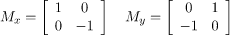
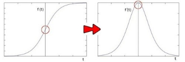
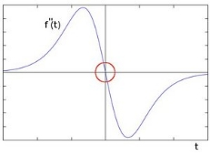

**Image Edge Detection**

**What is an Edge?**

- Edges are significant local changes of intensity in a digital image. An edge can be defined as a set of connected pixels that forms a boundary between two disjoint regions.

**What is Edge Detection?**

- Edge Detection is a method of segmenting an image into regions of discontinuity. It is a widely used technique in digital image processing like pattern recognition, image morphology and feature extraction.

**Edge Detection Operators are of two types:** 

**Gradient** – based operator which computes first-order derivations in a digital image like, Sobel operator, Prewitt operator, Robert operator

**Gaussian** – based operator which computes second-order derivations in a digital image like, Canny edge detector, Laplacian of Gaussian

1. **Sobel Operator** 

It is a discrete differentiation operator. At the pixels of an image, the Sobel operator produces either the normal to a vector or the corresponding gradient vector. It uses two 3 x 3 kernels to calculate the vertical and horizontal derivative approximations respectively.

The kernels can be applied separately to the input image, to produce separate measurements of the gradient component in each orientation (call these Gx and Gy). These can then be combined to find the absolute magnitude of the gradient at each point and the orientation of that gradient. The gradient magnitude is given by: 

**Advantages:** 

- Simple and time efficient computation
- Very easy at searching for smooth edges

**Limitations:** 

- Diagonal direction points are not preserved always
- Highly sensitive to noise
- Not very accurate in edge detection
- Detect with thick and rough edges does not give appropriate results

1. **Prewitt Operator** 

Almost like the Sobel operator. It also detects vertical and horizontal edges of an image.

**Advantages:** 

Good performance on detecting vertical and horizontal edges

Best operator to detect the orientation of an image

**Limitations:** 

The magnitude of coefficient is fixed and cannot be changed

Diagonal direction points are not preserved always

1. **Robert Operator** 

This gradient-based operator computes the sum of squares of the differences between diagonally adjacent pixels in an image through discrete differentiation. Then the gradient approximation is made. It uses the following 2 x 2 kernels or masks: -

**Advantages:** 

Detection of edges and orientation are very easy

Diagonal direction points are preserved

**Limitations:** 

Very sensitive to noise

Not very accurate in edge detection

1. **Canny** 

It is a gaussian-based operator in detecting edges. This operator is not susceptible to noise. It extracts image features without affecting or altering the feature. Canny edge detector have advanced algorithm derived from the previous work of Laplacian of Gaussian operator. Canny edge detection is an image processing method used to detect edges in an image while suppressing noise. 

The main steps are as follows:

1) **GAUSSIAN BLUR**

It uses a Gaussian filter for the removal of noise from the image, it is because this noise can be assumed as edges due to sudden intensity change by the edge detector.

1) **DETERMINE THE INTENSITY GRADIENTS**

The gradients can be determined by using a Sobel filter where A is the image. An edge occurs when the color of an image changes, hence the intensity of the pixel changes as well. Then, calculate the magnitude and angle of the directional gradients.

1) **NON-MAXIMUM SUPPRESSION**

The image magnitude produced results in thick edges. Ideally, the final image should have thin edges. Thus, we must perform non maximum suppression to thin out the edges. If, for example, we have three pixels that are next to each other: pixels a, b, and then c. Pixel b is larger in intensity than both a and c where pixels a and c are in the gradient direction of b. Therefore, pixel b is marked as an edge. Otherwise, if pixel b was not a local maximum, it would be set to 0 (i.e. black), meaning it would not be an edge pixel.

1) **DOUBLE THRESHOLDING**

The double threshold step aims at identifying 3 kinds of pixels: strong, weak, and non-relevant:

- Strong pixels are pixels that have an intensity so high that we are sure they contribute to the final edge.
- Weak pixels are pixels that have an intensity value that is not enough to be considered as strong ones, but not small enough to be considered as non-relevant for the edge detection.
- Other pixels are considered as non-relevant for the edge.

Now you can see what the double thresholds holds for:

- High threshold is used to identify the strong pixels (intensity higher than the high threshold)
- Low threshold is used to identify the non-relevant pixels (intensity lower than the low threshold)
- All pixels having intensity between both thresholds are flagged as weak and the Hysteresis mechanism (next step) will help us identify the ones that could be considered as strong and the ones that are considered as non-relevant.

1) **EDGE TRACKING BY HYSTERESIS (connect scattered lines)**

Now that we have determined what the strong edges and weak edges are, we need to determine which weak edges are actual edges. To do this, we perform an edge tracking algorithm. 

Weak edges that are connected to strong edges will be actual/real edges. 

Weak edges that are not connected to strong edges will be removed. 

Finally, we will iterate through the remaining weak edges and set them to zero resulting in the final processed image.

1. **Laplacian** 

Laplacian filters are derivative filters used to extract the vertical as well as horizontal edges from an image. This is how they separate themselves from the usual sobel filters. Because Sobel filters are single derivative filters, they can only find edges in a single dimension.

**How it works?**

In Sobel filters, they take one derivative and find an edge in either of the one dimension (x or y). It was because in the edge area, the pixel intensity shows a "jump" or a high variation of intensity.

Getting the first derivative of the intensity, we observed that an edge is characterized by a maximum, as it can be seen in the figure:

But with Laplacian filter, we can get edges in both dimensions, hence we take double derivative of the intensities. And what happens when we do double derivation, the graph points to zero. So, we will check those pixels which lead to zero and then mark them as edge points. 

Some of the most common filters used to create the Laplacian are:

by the following equation. As we discussed we need double derivation of every pixel, so that we can check the pixel intensities.

1. **Laplacian of Gaussian (LOG)**

The Laplacian filter is a bit too sensitive because these kernels are approximating a second derivative measurement on the image.

So, it will work badly if there is noise in the image. Hence we apply something known as a Gaussian Blur to smooth the image and make the Laplacian filter more effective.

Due to this addition of the gaussian filter, the overall filter is always in a pair. And in normal dialogues it is named Laplacian of/over the Gaussian Filter (LoG). Which shouldn’t be confused as another filter, but just that it comes with the Gaussian blur, nothing else.

**Resources**

1) <https://iq.opengenus.org/laplacian-filter/>
1) [OpenCV: Laplace Operator](https://docs.opencv.org/3.4/d5/db5/tutorial_laplace_operator.html)
1) <https://indiantechwarrior.com/canny-edge-detection-for-image-processing/>
1) <https://towardsdatascience.com/canny-edge-detection-step-by-step-in-python-computer-vision-b49c3a2d8123>
1) [Canny Edge Detector - Computerphile - YouTube](https://www.youtube.com/watch?v=sRFM5IEqR2w&t=291s)
