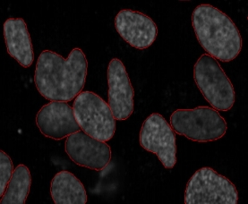
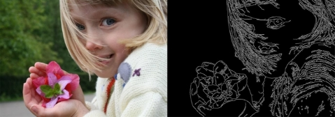
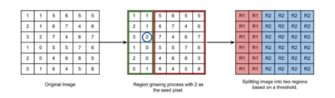

## Image segmentation: 

Dividing or partitioning the image into various parts called segments according to their features and properties. The primary goal of image segmentation is to simplify the image for easier analysis. For example: Let’s take a problem where the picture must be provided as input for object detection. Rather than processing the whole image, the detector can be inputted with a region selected by a segmentation algorithm. This will prevent the detector from processing the whole image thereby reducing inference time.

**Why do we need Image Segmentation?**

1. **Detecting Cancer** 

The shape of the cancerous cells plays a vital role in determining the severity of the cancer. You might have put the pieces together – object detection will not be very useful here. We will only generate bounding boxes which will not help us in identifying the shape of the cells. Image Segmentation techniques make a massive impact here. They help us approach this problem in a more granular manner and get more meaningful results. Here, we can clearly see the shapes of all the cancerous cells.

1. **Face Recognition**

The facial recognition technology uses image segmentation to identify the face. It must be able to identify the unique features of your face so that any unwanted party cannot access your phone or system.

1. **Image-Based Search**

Google and other search engines that offer image-based search facilities use image segmentation techniques to identify the objects present in your image and compare their findings with the relevant images they find to give you search results.

**The Different Types of Image Segmentation**

1. **Semantic segmentation** 

Studies the uncountable stuff in an image. Semantic segmentation refers to the classification of pixels in an image into semantic classes. Pixels belonging to a particular class are classified to that class with no other information or context taken into consideration.

1. **Instance Segmentation**

Typically deals with tasks related to countable things. Instance segmentation models classify pixels into categories based on “instances” rather than classes. An instance segmentation algorithm has no idea of the class a classified region belongs to but can segregate overlapping or very similar object regions based on their boundaries.

1. **Panoptic Segmentation**

The best of both worlds. It presents a unified image segmentation approach where each pixel in a scene is assigned a semantic label (due to semantic segmentation) and a unique instance identifier (due to instance segmentation). It assigns each pixel only one pair of a semantic label and an instance identifier. However, objects can have overlapping pixels. In this case, panoptic segmentation resolves the discrepancy by favoring the object instance, as the priority is to identify each thing rather than stuff.

**Image Segmentation Algorithms**

1. **Thresholding**

One of the easiest methods of image segmentation where a threshold is set for dividing pixels into two classes. The thresholding method converts a grey-scale image into a binary image by dividing it into two segments (required and not required sections).

According to the different threshold values, we can classify thresholding segmentation in the following categories:

**Simple Thresholding:**

Replace the image’s pixels with either white or black. Now, if the intensity of a pixel at a particular position is less than the threshold value, you’d replace it with black. On the other hand, if it’s higher than** the threshold, you’d replace it with white.

**Otsu’s Binarization:**

In simple thresholding, we picked a constant threshold value and used it to perform image segmentation. However, how do you determine that the value you chose was the right one? 

While the straightforward method for this is to test different values and choose one, it is not the most efficient one. 

Take an image with a histogram having two peaks, one for the foreground and one for the background. By using Otsu binarization, you can take the approximate value of the middle of those peaks as your threshold value. 

In Otsu binarization, you calculate the threshold value from the image’s histogram if the image is bimodal (The bimodal distribution has two peaks). 

This process is quite popular; however, it has many limitations. You can’t use it for images that are not bimodal (images whose histograms have multiple peaks).

**Adaptive Thresholding:**

Instead of using one constant threshold value for performing segmentation on the entire image, you can keep the threshold value variable. In this technique, we will keep different threshold values for different sections of an image. 

This method works well with images that have varying lighting conditions. You’ll need to use an algorithm that segments the image into smaller sections and calculates the threshold value for each of them.

1. **Edge Segmentation**

Edge segmentation, also called edge detection, is the task of detecting edges in images. 

From a segmentation-based viewpoint, we can say that edge detection corresponds to classifying which pixels in an image are edge pixels and singling out those edge pixels under a separate class correspondingly. 

Edge detection is generally performed by using special filters that give us edges of the image upon convolution. These filters are calculated by estimating image gradients in the x and y coordinates of the spatial plane.

1. **Clustering-based Segmentation**

Clustering is the task of dividing the population (data points) into several groups, such that data points in the same groups are more like 

other data points in that same group than those in other groups. These groups are known as clusters.

One of the most used clustering algorithms is k-means. Here, the k represents the number of clusters (not to be confused with k-nearest neighbor). 

**How k-means works:**

1. First, randomly select k initial clusters
1. Randomly assign each data point to any one of the k clusters
1. Calculate the centers of these clusters
1. Calculate the distance of all the points from the center of each cluster
1. Depending on this distance, the points are reassigned to the nearest cluster
1. Calculate the center of the newly formed clusters
1. Finally, repeat steps (4), (5) and (6) until either the center of the clusters does not change, or we reach the set number of iterations.

The key advantage of using k-means algorithm is that it is simple and easy to understand. We are assigning the points to the clusters which are closest to them.

**Fuzzy C Means**

With the fuzzy c-means clustering method, the pixels in the image can get clustered in multiple clusters. This means a pixel can belong to more than one cluster. However, every pixel would have varying levels of similarities with every cluster. The fuzzy c-means algorithm has an optimization function which affects the accuracy of your results.

1. **Region Based Segmentation**

In this segmentation, we grow regions by recursively including the neighboring pixels that are similar and connected to the seed pixel. The similarity between pixels can be in terms of intensity, color, etc. We use connectivity to prevent connecting different parts of the image.

Region-Based techniques are further classified into 2 types based on the approaches they follow:

- Region growing method
- Region splitting and merging method

1. **Region growing method** 

we start with some pixel as the seed pixel and then check the adjacent pixels. If the adjacent pixels abide by the predefined rules, then that pixel is added to the region of the seed pixel and the following process continues till there is no similarity left. 

Consider a seed pixel of 2 in the given image and a threshold value of 3, if a pixel has a value greater than 3 then it will be considered inside the seed pixel region. Otherwise, it will be considered in another region. Hence 2 regions are formed in the following image based on a threshold value of 3.

1. **Region splitting and merging method**

The whole image is first taken as a single region. If the region does not follow the predefined rules, then it is further divided into multiple regions (usually 4 quadrants) and then the predefined rules are carried out on those regions to decide whether to further subdivide or to classify that as a region. The following process continues till every region follows the predefined rules. In Region merging technique, we consider every pixel as an individual region. We select a region as the seed region to check if adjacent regions are similar based on predefined rules. If they are similar, we merge them into a single region and move ahead to build the segmented regions of the whole image.

