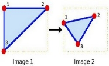

**Euclidean geometry**

It describes our three-dimensional world so well. In Euclidean geometry, the sides of objects have lengths, intersecting lines determine angles between them, and two lines are said to be parallel if they lie in the same plane and never meet. 

Moreover, these properties do not change when the Euclidean transformations (translation and rotation) are applied. 

**Projective Geometry** 

Projective geometry is an extension (or a simplification, depending on point of view) of Euclidean geometry, in which there is no concept of distance or angle measure. Intuitively, it can be understood as only having points and lines; in other words, while Euclidean geometry can be informally viewed as the study of straightedge and compass constructions, projective geometry can be viewed as the study of straightedge only constructions.

**Formal Definition of Projective Geometry**

A projective plane is defined by a set of points, a set of lines, and a property of incidence satisfying three properties:

1. For any two points, there is exactly one line incident with both of them.
1. For any two lines, there is exactly one point incident with both of them.
1. There are no parallel lines in the projective plane.

**Translation**

Translation is the shifting of an object's location. If you know the shift in the (x,y) direction and let it be (tx,ty), you can create the transformation matrix M as follows:

M=[10tx01ty]

I**t requires 2 degrees of freedom.**

**Affine transformation**

Affine transformation is a linear mapping method that preserves points, straight lines, and planes. Sets of parallel lines remain parallel after an affine transformation. The affine transformation technique is typically used to correct for geometric distortions or deformations that occur with non-ideal camera angles. 

It is a combination of transformations like rotation and scaling with translations. **It requires 6 degrees of freedom.**
# **Homography**
A homography is a type of projective transformation in that we take advantage of projections to relate two images. Homographies were originally introduced to study shifts in perspective, and they have enabled people to better understand how images change when we look at them from a different perspective.

**It requires 8 degrees of freedom.**

